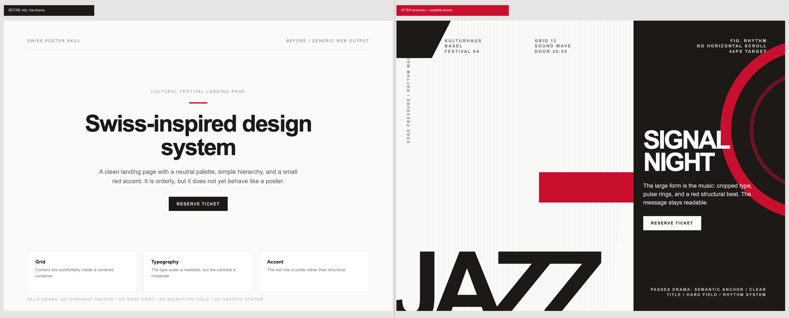

# Make Swiss poster outputs more dramatic and add eval proof

## What

This PR upgrades the `swiss-poster` skill so agents produce more dramatic, poster-like Tailwind/HTML instead of tidy Swiss-flavored SaaS layouts.

It adds:

- A web/UI output contract: implementable Tailwind/HTML, not SVG-only.
- A drama recipe based on the inspiration set at <https://swiss.ziki.boo/inspiration>:
  - one meaningful dominant poster-scale anchor
  - visible edge pressure/crop
  - readable primary title/date/CTA path
  - microtype/data labels
  - hard figure/ground field
  - geometry, rhythm, texture, or image treatment as a real graphic system
- Dramatic poster archetype snippets in `components.md`.
- Expanded prompting/checklist guidance, including anti-slop checks.
- Shared Skill Eval Harness coverage, ablations, and script oracles.
- A semantic/legibility eval for the specific “dramatic but hard to read / arbitrary giant date” failure mode.
- Motif-diversity evals for object, route/map, data/diagram, typographic specimen, photomontage, and civic/safety archetypes.
- A protected-reading-zone / contrast-channel heuristic and readability oracle for the “dramatic but unreadable” regression found in characterization posters.
- Artifact-fidelity, historical-grounding, and period/genre breadth rules for source ledgers, semantic image roles, encoded diagrams, functional microtype, prompt-leak prevention, designer-to-move mapping, palette lineage, material process, and avoiding accidental late-New-Wave anchoring.
- Before/after visual evidence for the intended output shift.

## Why

The previous guidance correctly covered grid, type scale, overlap, bleed, and accent color, but it could still lead to safe centered pages: heading, paragraph, small red rule, and card grid. The inspiration gallery shows that the strongest examples rely on one large graphic event and severe edge/figure-ground pressure.

Follow-up historical research also sharpened an important guardrail: Swiss poster drama is not illegibility. These posters had to communicate fast in public, so the big form must carry the message while the primary reading path stays clear.

This PR makes those requirements explicit and testable.

## Visual evidence

| Before | After |
| --- | --- |
| Generic Swiss-flavored web layout: centered hero, small accent line, equal cards. | Dramatic poster recipe: cropped semantic `JAZZ` anchor, readable title/CTA, microtype, hard field, red structural bar, concentric rhythm geometry, line field. |



Individual renders:

- Before: `docs/pr/before-after/before.png`
- After: `docs/pr/before-after/after.png`
- Combined: `docs/pr/before-after/before-after.png`

Same-content mini-pair gallery:

- Browser index: `docs/pr/before-after/pairs/index.html`
- Contact sheet: `docs/pr/before-after/pairs/contact-sheet.png`
- Generator: `docs/pr/before-after/pairs/generate_pairs.py`

Each mini pair preserves the same title, subtitle, metadata, CTA, and supporting items. Only the design treatment changes.

Source HTML for reproducing screenshots:

- `docs/pr/before-after/before.html`
- `docs/pr/before-after/after.html`
- `docs/pr/before-after/pairs/*.html`

## Ablations

Yes — `evals/shared-benchmark.json` now has 10 ablations:

1. `no-six-principles`
2. `no-gotchas`
3. `no-components`
4. `no-tokens`
5. `no-research`
6. `no-output-contract`
7. `no-dramatic-recipe`
8. `no-anti-slop`
9. `no-communication-before-spectacle`
10. `no-subject-archetype-selection`

The new ablations specifically target the added PR surface:

- removing the output contract should regress implementability / SVG-only avoidance / mobile safety;
- removing the dramatic recipe should regress back to tidy Swiss minimalism;
- removing anti-slop should allow gradient/card/SaaS drift;
- removing communication-before-spectacle should allow unreadable overlaps, arbitrary giant dates/numerals, and decorative anchors that do not communicate the subject;
- removing subject-archetype selection should regress to the same dark-field/red-bar/cropped-word/ring-line recipe instead of choosing the archetype from the subject.

## New semantic/legibility eval

Added two round-6 cases:

- `pos-semantic-legible-jazz` — asks for a jazz festival hero with no known date; the output must use a music/rhythm anchor instead of inventing a giant date and must keep title/CTA readable.
- `round6-audit-unreadable-drama` — fixture-backed audit of a hero that is visually dramatic but has an illegible title and arbitrary giant `62`; the output must reject that direction and propose a semantic rhythm/music replacement.

Added `evals/oracles/semantic_drama_oracle.py` to deterministically check this failure mode.

## New motif-diversity eval

Added six round-7 visible cases:

- `pos-object-poster-archetype`
- `pos-route-map-archetype`
- `pos-data-diagram-archetype`
- `pos-typographic-specimen-archetype`
- `pos-photomontage-archetype`
- `pos-civic-safety-archetype`

Added six private holdout placeholders that hide the archetype name and require subject inference:

- `holdout-subject-inference-01`
- `holdout-subject-inference-02`
- `holdout-subject-inference-03`
- `holdout-subject-inference-04`
- `holdout-subject-inference-05`
- `holdout-subject-inference-06`

The hidden prompts live under `evals/holdout/subject-inference-*.txt`; private answer keys live under `evals/holdout/answers/subject-inference-*.json`. These are gitignored so the public manifest does not leak the expected archetype.

Added `evals/oracles/motif_diversity_oracle.py` for per-output archetype checks and suite-level motif diversity scoring.

## New protected-reading-zone / contrast-channel eval

The characterization sheet showed a repeated failure mode: current reruns often put route lines, trust-boundary bars, giant words, or diagrams over the actual title/body/CTA.

Added:

- `evals/oracles/readability_oracle.py`
- `evals/fixtures/round8-overlapped-critical-text/current.html`
- `pos-protected-reading-zone-credential`
- `round8-audit-overlapped-critical-text`
- `pos-contrast-channel-night-closure`
- ablations: `no-protected-reading-zone`, `no-contrast-channel-discipline`

The heuristic: do not reduce poster contrast; allocate it. Critical title/date/body/CTA needs an uncontested local contrast channel, high z-index, and a quiet/hard field; dramatic anchors may stay severe but route around, sit behind, become the field, or demote to texture.

## New artifact-fidelity / historical-grounding eval

The after images also showed non-readability failures: template collapse, source-content loss, decorative image use, fake diagrams, prompt-shaped visible metadata, generic Swiss-poster UI-kit reuse, shallow historical grounding, and microtype as filler.

Added:

- `evals/oracles/artifact_integrity_oracle.py`
- `evals/fixtures/round10-after-image-defects/current.html`
- `pos-source-ledger-thread-recap`
- `pos-encoded-diagram-moq`
- `pos-historical-rhythm-public-concert`
- `pos-historical-figure-ground-theatre`
- `round10-audit-after-image-defects`
- ablations: `no-artifact-fidelity`, `no-historical-grounding`

Evidence: `eval-runs/current-round10-artifact-integrity-20260615/` has `with_skill=1.0`, `without_skill=0.2`, `ablation:no-artifact-fidelity=0.2`, `ablation:no-historical-grounding=0.6` across the five new objective cases. Two materialized copied-skill ablations also fail as intended.

## New period/genre breadth evals

Added ten round-11 cases for the remaining after-image issues:

- accidental late-1960s/1980s anchoring;
- black/white/red-or-orange palette narrowing;
- typographic violence overuse;
- visible web-grid/card scaffolding;
- weak lithographic/material surface;
- systems-diagram overuse;
- visible citation instead of embodied historical reference;
- weak photomontage authorship;
- insufficient Hofmann/Ruder restraint;
- missing genre breadth, especially Geigy/scientific plates.

Each has a paired ablation (`no-period-lineage-selection`, `no-palette-lineage-breadth`, `no-object-poster-restraint`, `no-print-proportion-audit`, `no-material-process-surface`, `no-diagram-restraint`, `no-embodied-reference-discipline`, `no-photomontage-authorship`, `no-restraint-as-drama`, `no-genre-breadth-selection`).

## Testing

Commands run:

```sh
python3 ../updating_all_of_my_skills/skill-eval-harness/skill_benchmark.py validate evals/shared-benchmark.json
python3 ../updating_all_of_my_skills/skill-eval-harness/skill_benchmark.py prepare evals/shared-benchmark.json --split tune --out /tmp/swiss-tune-tasks.jsonl
python3 ../updating_all_of_my_skills/skill-eval-harness/skill_benchmark.py audit-manifest evals/shared-benchmark.json --format markdown --out /tmp/swiss-audit-all.md
python3 ../updating_all_of_my_skills/skill-eval-harness/skill_benchmark.py benchmark evals/shared-benchmark.json --runs ../updating_all_of_my_skills/swiss-poster-skill/eval-runs/all-53-ablation-smoke-20260610 --split tune --allow-scripts --out /tmp/current-manifest-on-smoke.json
python3 -m json.tool skills.sh.json >/dev/null
python3 -m json.tool evals/shared-benchmark.json >/dev/null
python3 -m py_compile evals/oracles/*.py
git diff --check
```

Results:

- Manifest validates: 56 cases, 24 ablations.
- Holdout dry-run prepare emits 14 hidden-prompt task rows: 7 holdout cases x with/without skill.
- Combined visible tune suite in `eval-runs/current-full-plus-round7-boundary-20260613/`:
  - `with_skill`: 1.000 objective / 1.000 combined
  - `without_skill`: 0.550 objective / 0.550 combined
  - With-skill judge rows: 24/24 passed
  - Trigger eval: 6/6 passed
- Round-7 motif targeted suite:
  - `with_skill`: 6/6, mean 1.000
  - `without_skill`: mean 0.167
  - `ablation:no-subject-archetype-selection`: mean 0.667
- Suite-level motif diversity:
  - Before round-7 diversity cases: failed, semantic coverage 3/6, max motif share 0.889
  - After round-7 diversity cases: passed, semantic coverage 6/6, max motif share 0.533
- Full report: `docs/pr/EVAL_REPORT-current-full-plus-round7-boundary-20260613.md`
- Viewer: `docs/pr/eval-viewer-current-full-plus-round7-boundary-20260613.html`
- `drama_oracle.py` was also run against prior outputs and correctly flagged earlier “improved” output for missing a real graphic system.

Important caveat: legacy positive cases still use line fields heavily (8/15 positive outputs). The new subject-archetype cases improve suite diversity, but future holdouts should hide the archetype name and require the model to infer it from subject matter.

Screenshot generation used local Chrome headless:

```sh
/Applications/Google\ Chrome.app/Contents/MacOS/Google\ Chrome \
  --headless=new --disable-gpu --hide-scrollbars \
  --window-size=1200,900 \
  --screenshot=docs/pr/before-after/after.png \
  file://$PWD/docs/pr/before-after/after.html
```

## Risk

Low to moderate.

- The skill text is more prescriptive, which should improve dramatic poster output but may reduce freedom for restrained Swiss-minimal requests. The output contract explicitly says to restrain the composition when users reject poster drama.
- The new deterministic `drama_oracle.py` checks carriers of drama, not aesthetics. It should be treated as a guardrail, not a complete visual judge.
- Existing leakage warnings in the shared benchmark are documented by the audit and can be cleaned up in a follow-up.
